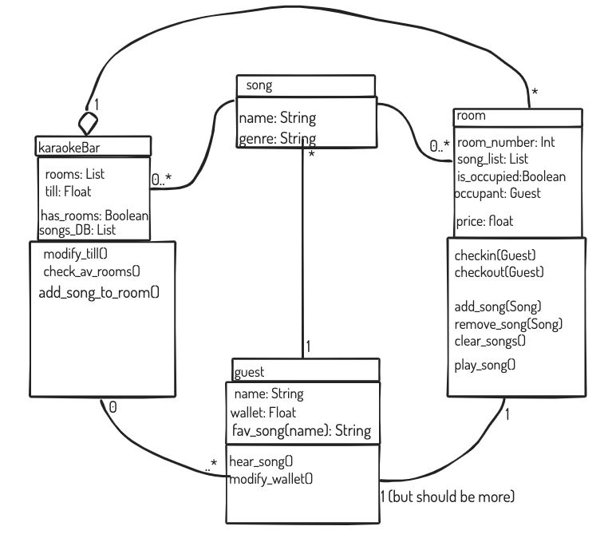

# Starting homework: 
- [X] Setup files structures and __init__ files 
- [X] Create reposiroty on github and get link for this
- [X] git init, commit and add to github: 
<pre>              
                git init
                git commit -m "first commit"
                git remote add origin https://github.com/marekboro/cc_karaoke_homework_w2.git
                git push -u origin master </pre>

## Creating and adding to a branch:  
<pre>
                git checkout -b BRANCHNAME
                git add . from within the branch
                git push origin BRANCHNAME
</pre>

## Rough Sketch of the plan:?  

Testing code to use: 
<code><pre>
def test_name_describing_test(self):
&ensp;&ensp;&ensp;&ensp;expected =
&ensp;&ensp;&ensp;&ensp;actual =
&ensp;&ensp;&ensp;&ensp;self.assertEqual(expected,actual)
</pre>
</code>

# **TO DO:** 
1. 
- [X] &ensp;&ensp;Create a new branch to work on the testing **Guest**
- [X] &ensp;&ensp;Upload to github
- [X] &ensp;&ensp;Test what guest needs to do and iterate over the plan image, adding any aditional features etc
- [X] &ensp;&ensp;Final upload of branch, merge and branch removal

2. 
- [X] &ensp;&ensp;Create a new branch to work on the testing **Song**
- [X] &ensp;&ensp;Upload to github
- [X] &ensp;&ensp;Test what guest needs to do and iterate over the plan image, adding any aditional features etc
- [X] &ensp;&ensp;Final upload of branch, merge and branch removal

3. 
- [X] &ensp;&ensp;Create a new branch to work on the testing **Room**
- [X] &ensp;&ensp;Upload to github
- [X] &ensp;&ensp;Test what guest needs to do and iterate over the plan image, adding any aditional features etc
- [X] &ensp;&ensp;Final upload of branch, merge and branch removal

4. 

- [X] &ensp;&ensp;Create a new branch to work on the testing **KaraokeBar**
- [X] &ensp;&ensp;Upload to github
- [X] &ensp;&ensp;Test what guest needs to do and iterate over the plan image, adding any aditional features etc
- [X] &ensp;&ensp;Final upload of branch, merge and branch removal