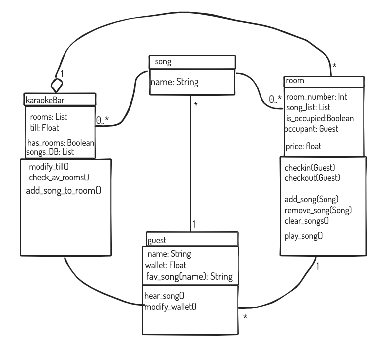

# Starting homework: 
- [X] Setup files structures and __init__ files 
- [X] Create reposiroty on github and get link for this
- [X] git init, commit and add to github: 
<pre>              
                git init
                git commit -m "first commit"
                git remote add origin https://github.com/marekboro/cc_karaoke_homework_w2.git
                git push -u origin master </pre>

## Creating and adding to a branch:  
<pre>
                git checkout -b BRANCHNAME
                git add . from within the branch
                git push origin BRANCHNAME
</pre>

## Rouch Sketch of the plan:?  

