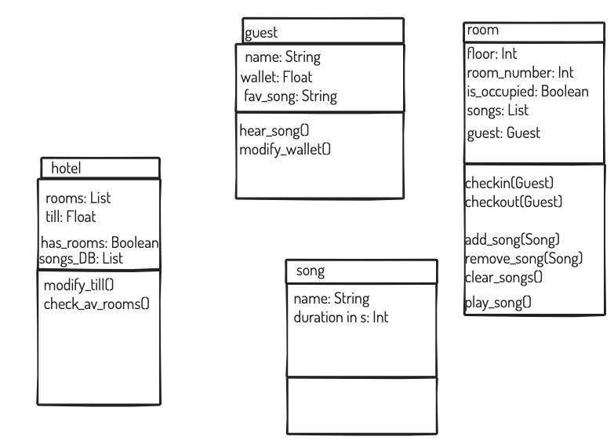

1. git init
2. git add README.md
3. git commit -m "first commit"
4. git remote add origin https://github.com/marekboro/cc_karaoke_homework_w2.git
5. git push -u origin master

6. git checkout -b BRANCHNAME - creates a branch of the
7. git add . from within the branch
8. git push origin BRANCHNAME 

9. 
